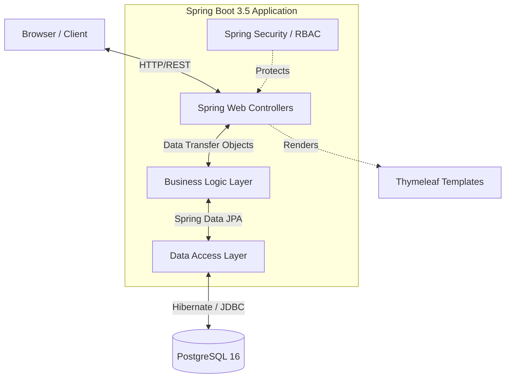

<div align="center">
  <h1>🏡 HomeNest</h1>
  <p><strong>A full-stack, responsive accommodation booking platform built for scale, featuring multi-role access, real-time availability checking, and a comprehensive admin suite.</strong></p>

  <p>
    <a href="#-overview">Overview</a>
    ·
    <a href="#-key-features">Features</a>
    ·
    <a href="#-architecture--tech-stack">Architecture</a>
    ·
    <a href="#-technical-highlights">Technical Highlights</a>
    ·
    <a href="#-getting-started">Getting Started</a>
  </p>

  <p>
    
    
    
    
    
  </p>
</div>

---

## 🌟 Overview

**HomeNest** is a comprehensive, multi-tenant property booking ecosystem designed to seamlessly connect guests with hosts. Developed as a full-stack monolith to demonstrate proficiency in enterprise Java development, the application enforces robust role-based access control (RBAC), complex booking conflict resolution, and data integrity via relational database constraints.

The UI implements a custom "Boutique Editorial" design system, prioritizing typography and whitespace over heavy frameworks, resulting in a highly performant and accessible user experience.

> **Status:** Fully functional local environment. Containerized and ready for cloud deployment.

## ✨ Key Features & Business Value

### 🛡️ Multi-Role Architecture
- **Guests:** Intuitive search, booking management, and post-stay review capabilities.
- **Hosts:** Comprehensive dashboard for property management, revenue tracking, and booking request moderation.
- **Administrators:** Global control panel with real-time KPIs, transaction auditing, and platform moderation tools.

### 📅 Advanced Booking Engine
- Implemented robust date-range validation to prevent double-booking.
- Real-time availability checks and state management (Pending, Confirmed, Rejected, Completed).

### 🎨 Custom Design System (Boutique Editorial)
- Developed a bespoke, CSS-driven design system independent of heavy component libraries.
- Features *Playfair Display* & *Work Sans* typography, zero-border-radius components, and a warm cream palette for a premium aesthetic.
- Fully responsive layout utilizing CSS Grid and Flexbox (Mobile to Desktop).

### 📊 Analytics & Reporting
- Dynamic KPI generation for Hosts and Admins.
- Automated CSV export for transaction histories and financial auditing.

---

## 🏗️ Architecture & Tech Stack

HomeNest utilizes a classic, robust MVC architecture powered by the Spring ecosystem, containerized for reliable deployment.



### Core Technologies
- **Backend:** Java 17, Spring Boot 3.5, Spring Security, Spring Data JPA
- **Frontend:** Thymeleaf (Server-Side Rendering), Custom CSS (Boutique Editorial), HTML5
- **Database:** PostgreSQL 16
- **DevOps:** Docker, Docker Compose, Maven (Multi-stage builds)

---

## 🧠 Technical Highlights (For the Engineering Team)

### 1. Robust Security Implementation
Leveraged **Spring Security** to implement strict Role-Based Access Control (RBAC). The application distinguishes between `ROLE_GUEST`, `ROLE_HOST`, and `ROLE_ADMIN` seamlessly. Route protection ensures that Hosts cannot access Admin endpoints, and Guests cannot modify Host properties, preventing lateral privilege escalation.

### 2. Containerized Development Workflow
The entire stack is containerized using **Docker** and **Docker Compose**. A multi-stage `Dockerfile` is utilized to cache Maven dependencies during the build process and generate a minimal JRE runtime image, drastically reducing the final container size and deployment time.

### 3. Data Integrity & Concurrency
The booking system is the core domain model. I utilized Spring Data JPA with proper transactional boundaries (`@Transactional`) to handle concurrent booking operations. The PostgreSQL database employs strict foreign key constraints to guarantee data integrity across users, properties, and transactions.

---

## 🚀 Getting Started (Local Development)

The project is pre-configured for a frictionless developer experience using Docker.

### Prerequisites
- Docker & Docker Compose
- *Alternative:* JDK 17, Maven, local PostgreSQL instance

### 🐳 Quick Start (Docker - Recommended)

1. **Clone the repository:**
   ```bash
   git clone <repository-url>
   cd homenest-app
   ```

2. **Spin up the stack:**
   ```bash
   docker compose up --build
   ```
   *This command provisions the PostgreSQL database, automatically applies the schema, seeds the initial admin user, and starts the Spring Boot application.*

3. **Access the application:**
   Navigate to `http://localhost:8080`

### 👤 Default Seed Data

| Role | Email | Password |
|------|-------|----------|
| Admin | admin@homenest.com | 1234 |

*(Note: For security reasons, default passwords should be changed in a production environment. Additional Guest and Host accounts can be created via the `/register` portal.)*

---

## 📁 Project Structure

```text
homenest-app/
├── src/main/java/com/homenest/
│   ├── config/          # Spring Security & App Configurations
│   ├── controller/      # MVC Controllers (Routing & HTTP handling)
│   ├── model/           # JPA Entities (User, Listing, Booking, etc.)
│   ├── repository/      # Data Access Interfaces
│   └── service/         # Core Business Logic & Transaction Management
├── src/main/resources/
│   ├── static/          # Custom CSS, Assets
│   └── templates/       # Thymeleaf HTML Views
├── Dockerfile           # Multi-stage build definition
└── docker-compose.yml   # Infrastructure orchestration
```

---

## 🛣️ Future Enhancements

- **Payment Gateway Integration:** Implement Stripe API for live transaction processing.
- **RESTful API Extraction:** Migrate Thymeleaf views to a decoupled React/Next.js frontend.
- **Advanced Search:** Integrate Elasticsearch for geo-spatial querying and fuzzy text search.

---

<div align="center">
  <i>Seeking Software Engineering opportunities. Let's connect!</i><br>
  <a href="https://www.linkedin.com/in/abdul-rafy-b11829315/">LinkedIn</a> • <a href="mailto:abdulrafykz@gmail.com">Email</a>
</div>
